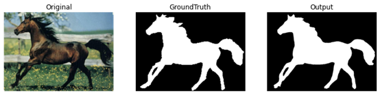

# DenseASPP

This repository includes the pytorch implementation of [DenseASPP for Semantic Segmentation in Street Scenes(CVPR2018)](https://openaccess.thecvf.com/content_cvpr_2018/papers/Yang_DenseASPP_for_Semantic_CVPR_2018_paper.pdf). Experiments are conducted on [Wiezmann Horse](https://www.kaggle.com/datasets/ztaihong/weizmann-horse-database/metadata) Dataset. And it's also a course assignment.





## Prepare Your Data


1. Download [Weizmann Horse](https://www.kaggle.com/datasets/ztaihong/weizmann-horse-database/metadata) dataset.

2. The final path structure used in my code looks like this:

```
$PATH_TO_DATASET/
├──── weizmann_horse_db
│    ├──── horse (327 images)
│    ├──── mask (327 images)
```


## Inference

Run the following command to do inference of DenseASPP on Wiezmann Horse dataset:

```
python main.py --phase='eval'
```

Please note that

- Store the weights in the folder named "pretrained". Link to the pretrained weights is provided in the table below. You could download the file and move it to the corresponding directory(which I mean store it in the folder "pretrained")
- to reproduce the results reported in the table, make sure use the splits I have provided in the dataset file, which are train_list.txt and test_list.txt, consisting of names of images for training and testing, respectively.)

Here is the results of DenseASPP on Wizemann Horse dataset(Please see visualization.ipynb for details)

| Base Model  |      Structure      | #Param. | mIoU  | Boundary IoU |                            Model                             |
| :---------: | :-----------------: | :-----: | :---: | :----------: | :----------------------------------------------------------: |
| DenseNet121 | ASPP(6, 12, 18, 24) |  10.2M  | 91.0% |    75.2%     | [Baidu Netdisk(password:2022)](https://pan.baidu.com/s/1ikRL5MeQFY2l_wZGvDmmsw) |


## Training


Run the following command to train DenseASPP:

```
python main.py --phase='train'
```

- I randomly shuffle the dataset for training and testing: 85% for training and 15% for testing. You can do that in whatever way you like, but make sure you keep them in forms that are consistent with what I have done to train_list.txt and test_list.txt.
